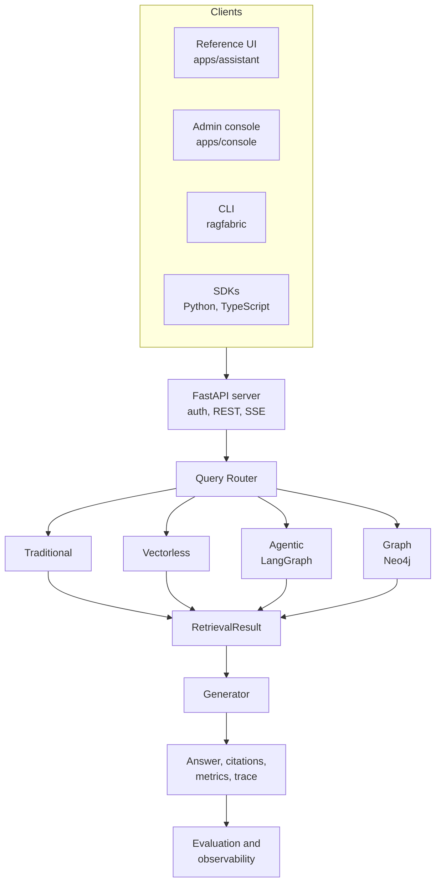

<h1 align="center">RagFabric</h1>

<p align="center">
  <b>Self hosted, measurement first RAG platform.</b><br/>
  Run your documents through four retrieval architectures, measure accuracy, latency and cost on your own corpus,
  then serve the winner behind a query router. Bring your own LLM, database and hosting.
</p>

<p align="center">
  <a href="LICENSE"></a>
  <a href="https://github.com/ranjan-del/ragfabric/actions"></a>
  
</p>

> **Status: planning and early build.** The repository currently contains the v1 single strategy
> assistant (working, tested, offline first). RagFabric is being built on top of it phase by phase.
> See [ROADMAP.md](ROADMAP.md) for what exists and what is next. Nothing in this README claims a feature
> that is not marked as shipped in the roadmap. Repository renamed from `enterprise-rag-knowledge-assistant` to `ragfabric` on 2026-09-13; old links redirect. Documentation lives in [docs/](docs/README.md).

---

## Table of contents

1. [What it is](#what-it-is)
2. [Why multiple RAG architectures exist](#why-multiple-rag-architectures-exist)
3. [The four strategies](#the-four-strategies)
4. [How to choose a RAG architecture](#how-to-choose-a-rag-architecture)
5. [Query router](#query-router)
6. [Architecture](#architecture)
7. [Everything is configurable](#everything-is-configurable)
8. [Access control](#access-control)
9. [Observability](#observability)
10. [Evaluation methodology](#evaluation-methodology)
11. [Benchmark results](#benchmark-results)
12. [Technology stack](#technology-stack)
13. [Installation](#installation)
14. [Configuration](#configuration)
15. [Example queries](#example-queries)
16. [Repository layout](#repository-layout)
17. [What works today (v1)](#what-works-today-v1)
18. [Limitations](#limitations)
19. [Roadmap and future improvements](#roadmap-and-future-improvements)
20. [Contributing](#contributing)
21. [License](#license)

---

## What it is

Most RAG tools give you one retrieval approach and a chat box. RagFabric gives you four retrieval
architectures behind one interface, a router that picks between them per question, and an evaluation
harness that tells you, with numbers from real runs on your documents, which one to use and what it costs.

It is built for teams who need to answer a harder question than "can we do RAG":

> Given our documents, our questions, and our budget, **which** retrieval architecture should we run, and **why**?

Adopters keep their own infrastructure. The LLM provider, embedding model, vector store, lexical store,
graph store, relational database, cache, auth and document connectors are all interfaces with multiple
implementations. The admin console controls who can access which documents. The reference UI is a folder
you can restyle or delete.

It is also a teaching codebase. Every important component explains what it does, why it is needed, how
it works, what the alternatives were and which trade-off was taken.

## Why multiple RAG architectures exist

Retrieval Augmented Generation fetches relevant text before the model answers, so the answer is grounded
in your data rather than the model's memory. The fetch step is the whole game, and there is no single
best way to do it:

| Question shape | What retrieval has to do | Which architecture is built for it |
|---|---|---|
| "What is the parental leave policy?" | Find the passage whose meaning matches | Traditional (vector similarity) |
| "Find invoice INV-2026-0413" | Match an exact token that embeddings blur | Vectorless (lexical) |
| "Compare the 2025 and 2026 travel policies and list what changed" | Retrieve several times, check evidence, refine | Agentic (iterative) |
| "Which teams report to the CTO and what policies apply to them?" | Follow relationships across documents | Graph (entities and edges) |

A production system needs more than one of these, and it needs to know which to use. That is what this
project measures and then automates.

## The four strategies

### Traditional RAG

```
query -> embed -> vector search (top k) -> similarity threshold -> optional rerank -> context -> LLM -> answer + citations
```

Text is tokenised and passed through an embedding model that produces a vector; texts with similar meaning
get vectors pointing in similar directions. Chunks are embedded at ingestion and stored in a vector store
(pgvector or Chroma). At query time the question is embedded with the same model and the nearest chunks
are returned by cosine similarity. A threshold stops the system quoting the nearest neighbour when the
nearest neighbour is unrelated, and an optional reranker re-scores the candidates with a stronger model.

Strong on paraphrase and meaning. Weak on exact identifiers, numbers and rare terms. Lowest latency and
cost of the four.

### Vectorless RAG

```
query -> lexical search (BM25 and PostgreSQL full text) -> fusion -> context -> LLM -> answer + citations
```

No embeddings. BM25 scores a chunk by how often the query terms occur in it (term frequency), how rare
those terms are across the corpus (inverse document frequency), with saturation and length normalisation
controlled by `k1` and `b`. PostgreSQL full text search adds stemming and phrase queries. The two are fused.

Strong on names, IDs, codes, technical terms and known phrases, and it costs nothing to index. Weak on
synonyms and paraphrase, because it matches tokens, not meaning. This is not "keyword search" in the
naive sense: ranking, saturation and length normalisation are what make it competitive.

### Agentic RAG

```
query -> analyze -> decide information need -> retrieve (tools) -> evaluate evidence
      -> enough? no: rewrite query, retrieve again (bounded) | yes: generate -> verify -> answer
```

Built with LangGraph as an explicit state machine: typed state, nodes for each step, conditional edges,
a hard iteration budget. The agent can call semantic search, lexical search and fetch-full-document as
tools, judges whether the evidence answers the question, rewrites the query when it does not, and verifies
the final answer against the evidence. Every step is recorded in the trace with its calls, tokens and cost.

Strong on multi part, comparative and vague questions. Highest and most variable latency and cost. The
hard engineering problem is stopping correctly, which is why the budget and the evidence evaluation are
first class.

### Graph RAG

```
ingest: chunks -> entity extraction -> relationship extraction -> entity resolution -> Neo4j (with source chunk links)
query:  entities in question -> match nodes -> traverse k hops -> collect supporting chunks -> context -> LLM
```

Documents are read once by an LLM that extracts entities (people, organisations, departments, products,
policies, technologies, projects, locations, dates) and the relationships between them. Duplicate entities
are resolved and merged. Every node and edge keeps a link to the chunk it came from, which is what makes
citations possible. A question is answered by finding its entities in the graph, walking relevant edges,
and pulling the source chunks along the path.

Strong on relationship and multi hop questions. Expensive at index time, since every chunk goes through
extraction, and only as good as the extraction. Highest engineering complexity of the four.

## How to choose a RAG architecture

No architecture is universally best. Choose on four axes, then verify with the evaluation harness on
your own corpus.

| Axis | Traditional | Vectorless | Agentic | Graph |
|---|---|---|---|---|
| Latency | Lowest | Low | Highest, variable | Medium |
| Accuracy | Good on direct semantic lookups | Best on exact terms and identifiers | Best on complex and multi part questions | Best on relationship and multi hop questions |
| Cost per query | Lowest | Lowest, no embedding cost | Highest, several LLM calls | Low at query time, high at index time |
| Engineering complexity | Low | Low | Medium | High |
| Choose it when | Most questions are simple lookups | Users search by names, codes, IDs, quotes | Users ask hard questions and will wait | The corpus is entity heavy and questions follow relationships |

**Hybrid approaches** are the norm in production: Traditional plus Vectorless fusion for everyday
questions, the router escalating to Agentic only when the simple path scores low, and Graph enabled only
for corpora whose questions are about relationships. RagFabric's router implements exactly this escalation
and records every fallback, so the hybrid behaviour is observable rather than assumed.

## Query router

The router chooses a strategy per question in AUTO mode, or is bypassed in MANUAL mode so every strategy
can be tested independently. It combines cheap signals (identifiers, quoted phrases, entity count,
comparison and aggregation words, question length) with a small classification call, and returns:

```json
{
  "selected_strategy": "agentic_rag",
  "confidence": 0.87,
  "reasoning": "The question compares two policies across documents and may need more than one retrieval.",
  "query_type": "comparison",
  "estimated_complexity": "high",
  "expected_cost_level": "high",
  "expected_latency_level": "high"
}
```

The reasoning is a short, user safe explanation. Hidden chain of thought is never exposed. When a strategy
returns no usable evidence or the confidence is low, a fallback chain runs (for example Graph to
Traditional, Vectorless to Traditional) and the run records `fallback_from`.

## Architecture



Every strategy implements one interface and returns one result shape:

```python
class RetrieverStrategy(Protocol):
    def retrieve(self, query: str, ctx: RetrievalContext) -> RetrievalResult: ...
```

`RetrievalResult` carries the chunks with their source metadata, relevance scores where available, the
number of retrieval and LLM calls, tokens, latency, a trace and an optional `fallback_from`. Generation,
citation checking, metrics and evaluation run the same code regardless of which strategy produced it.
That is what makes the comparison fair.

Dependency direction is strict: UIs depend on the SDK, the SDK on the HTTP contract, the server on the
engine, the engine on its own interfaces. Provider and store implementations plug in from outside.

## Everything is configurable

One `ragfabric.yaml` plus environment variables for secrets. Each row is an interface with at least two
implementations, so swapping is configuration, not code.

| Concern | Interface | Planned implementations |
|---|---|---|
| LLM | `LLMProvider` | OpenAI, Anthropic, Ollama, any OpenAI compatible endpoint |
| Embeddings | `EmbeddingProvider` | OpenAI, Ollama, offline hashing (tests) |
| Reranker | `Reranker` | none, LLM rerank, cross encoder |
| Vector store | `VectorStore` | PostgreSQL pgvector, Chroma |
| Lexical store | `LexicalStore` | PostgreSQL full text, in process BM25 |
| Graph store | `GraphStore` | Neo4j, none |
| Relational DB | SQLAlchemy | PostgreSQL, SQLite for development |
| Cache and rate limits | `Cache` | Redis, in memory |
| Auth | `AuthProvider` | Local users with JWT, API keys; OIDC later |
| Document sources | `Connector` | Upload, watched folder; Drive, Slack, Jira later |
| Telemetry export | OpenTelemetry | OTLP to any backend, off by default |

## Access control

Roles per workspace, groups with read or write grants on collections, per document overrides, scoped and
rate limited API keys, and an audit log of every run. The permitted document set is computed once per
request and applied **inside** every store query, so a chunk the caller may not read is never ranked,
never enters the model context and never appears in a citation. The policy lives in the engine, not the
UI, so replacing the UI cannot remove it. The admin console manages all of this.

## Observability

One trace per request with spans for the router, each retrieval call, each LLM call, generation and
citation checking, each agent node and each graph traversal. LLM spans carry tokens and estimated cost.
Traces are stored for the built in Trace page and dashboards (latency percentiles, cost per day, calls per
strategy, fallback rate, quality trend) and exported over OTLP when configured.

## Evaluation methodology

The repository ships a synthetic company corpus and a `questions.json` with eight categories: simple
factual, multi document, multi hop, comparison, relationship, exact match, ambiguous, complex reasoning.
Each test case has a question, expected answer, expected sources, type and difficulty. You can add your
own questions over your own corpus.

| Family | Metrics |
|---|---|
| Retrieval | precision, recall, hit rate, mean reciprocal rank against expected sources |
| Generation | answer correctness, faithfulness, context relevance, citation correctness (LLM judge with a fixed rubric plus a deterministic citation check) |
| System | total, retrieval and generation latency; LLM and retrieval calls; input and output tokens; estimated cost |
| Engineering | complexity score 1 to 5 (infrastructure, components, operations, debugging, maintenance), labelled as an engineering assessment, not measured data |

`make eval` runs the full set through all four strategies, stores every run, and regenerates
`docs/benchmarks/latest.md` with the commit, models and date that produced it.

## Benchmark results

**No results yet.** Numbers appear here only when produced by `make eval` on a tagged commit. This section
is generated, never typed. Until v0.5.0 ships it stays empty on purpose.

## Documentation

| Read | For |
|---|---|
| [docs/getting-started.md](docs/getting-started.md) | Install and first question |
| [docs/architecture.md](docs/architecture.md) | Layers, request flow, data model |
| [docs/traditional-rag.md](docs/traditional-rag.md), [vectorless-rag.md](docs/vectorless-rag.md), [agentic-rag.md](docs/agentic-rag.md), [graph-rag.md](docs/graph-rag.md) | One document per strategy: what, why, internals, trade offs, failure modes |
| [docs/routing.md](docs/routing.md) | Router decision, signals, fallbacks |
| [docs/evaluation.md](docs/evaluation.md) | Dataset, metrics, `make eval`, complexity score |
| [docs/configuration.md](docs/configuration.md), [providers.md](docs/providers.md) | `ragfabric.yaml`, environment, provider and store matrix |
| [docs/troubleshooting.md](docs/troubleshooting.md) | Symptoms, causes, fixes |
| [docs/adr](docs/adr), [docs/design](docs/design) | Decisions and the full design |

## Technology stack

| Layer | Choice |
|---|---|
| Engine and API | Python 3.12, FastAPI, Pydantic, SQLAlchemy, Alembic |
| Agents | LangGraph |
| Stores | PostgreSQL 16 with pgvector, Chroma, Neo4j 5, Redis |
| Frontend | Angular 17, TypeScript, Tailwind CSS |
| Tooling | uv, Docker Compose, GitHub Actions, OpenTelemetry |

Frameworks are used where they pay for themselves. Retrieval logic is written out and readable rather
than hidden behind a single library call.

## Installation

Two compose profiles. `lite` is three services and is enough for Traditional and Vectorless RAG.
`full` adds Chroma and Neo4j for all four.

```bash
git clone https://github.com/ranjan-del/ragfabric.git
cd ragfabric
cp .env.example .env            # add your provider key, or use Ollama with no key
docker compose --profile lite up --build
# or
docker compose --profile full up --build
```

Then open the UI, sign in with the bootstrap admin from your `.env`, upload documents, and ask.

> The profiles above land in v0.1.0. Today the repository runs the v1 assistant with `docker compose up`
> as described in [What works today](#what-works-today-v1).

## Configuration

```yaml
# ragfabric.yaml (planned shape)
llm:        { provider: openai, model: gpt-4.1-mini }
embeddings: { provider: openai, model: text-embedding-3-small }
vector_store:  { kind: pgvector }
lexical_store: { kind: postgres_fts }
graph_store:   { kind: neo4j, enabled: false }
strategies:
  traditional: { top_k: 5, similarity_threshold: 0.25, rerank: none }
  agentic:     { max_iterations: 4 }
router: { mode: auto, min_confidence: 0.6 }
limits: { max_cost_per_query_usd: 0.05, max_latency_ms: 20000 }
```

Secrets stay in the environment: `OPENAI_API_KEY`, `ANTHROPIC_API_KEY`, `DATABASE_URL`, `JWT_SECRET`,
`NEO4J_PASSWORD`. See `.env.example`. Pricing used for cost estimates lives in `pricing.yaml` and is
labelled as an estimate everywhere it is shown.

## Example queries

| Query | Expected route | Why |
|---|---|---|
| "How many days of casual leave do interns get?" | Traditional | Direct semantic lookup |
| "Show me policy HR-POL-2026-07" | Vectorless | Exact identifier |
| "Compare the 2025 and 2026 leave policies and list what changed" | Agentic | Comparison across documents, may need more than one retrieval |
| "Which teams report to the CTO and which security policies apply to them?" | Graph | Relationships across people, teams and policies |

Manual mode lets you force any strategy on any query and compare the four side by side.

## Repository layout

```
packages/core            engine: strategies, router, ingestion, evaluation, access policy, interfaces
packages/server          FastAPI application
packages/cli             ragfabric command
packages/sdk-python      typed client
packages/sdk-typescript  typed client (@ragfabric/sdk)
apps/console             admin console (Angular)
apps/assistant           reference end user UI (Angular), restyle or replace
deploy/compose           lite and full profiles
evaluation               corpus, questions.json, runner, latest results
docs                     concepts, guides, ADRs, design, benchmarks
examples                 minimal integrations
```

This layout is introduced in v0.1.0 (Phase 1). Until then the v1 `backend/` and `frontend/` folders remain.
Design details: [docs/design/2026-09-13-ragfabric-design.md](docs/design/2026-09-13-ragfabric-design.md)
and the ADRs in [docs/adr](docs/adr).

## What works today (v1)

The current `main` is a complete single strategy assistant that runs offline with no API key:

- Ingestion for PDF, DOCX, PPTX, TXT and CSV with page numbers and character spans that survive into citations
- Chunking with overlap, a deterministic hashing embedder, an in memory cosine index rebuilt from the database on startup
- Semantic and hybrid retrieval, an extractive answer generator whose every clause is a verbatim quote from a numbered source, with relevance floors on citations
- JWT auth, two role RBAC, bootstrap admin, production safety rails, Alembic migrations with a drift test
- Angular app with login, dashboard, upload, ask, collections, analytics and admin pages
- 107 backend tests and 20 frontend tests, CI runs the migrations against real PostgreSQL

```bash
cd backend && uv venv --python 3.12 && source .venv/bin/activate && uv pip install -r requirements.txt
uvicorn app.main:app --reload            # API on :8000
cd ../frontend && npm ci && npm start     # UI on :4200
```

The hashing embedder and extractive generator are kept in RagFabric as the no key test double, which is
why the test suite stays green without secrets.

## Limitations

- Pre alpha. Only v1 features are usable today; everything else is a plan with a phase number.
- The four strategies need a real LLM and embedding provider. Ollama is the free path; quality depends on the local model.
- Graph RAG quality is bounded by extraction quality, and extraction costs one LLM call per chunk at index time.
- Agentic RAG latency is variable by design. The budget caps it, but it will always be the slowest.
- Single workspace per install. Multi tenancy is not planned before v1.0.
- Evaluation with an LLM judge has its own bias; the deterministic citation check is the ground truth for citations.

## Roadmap and future improvements

See [ROADMAP.md](ROADMAP.md) and [CHANGELOG.md](CHANGELOG.md).

| Release | Theme |
|---|---|
| v0.1.0 | Initial RAG engine: interfaces, providers, ingestion, access control, Traditional and Vectorless RAG, CLI, Python SDK, console |
| v0.2.0 | Agentic retrieval with LangGraph |
| v0.3.0 | Graph retrieval with Neo4j |
| v0.4.0 | Adaptive router with fallbacks |
| v0.5.0 | Evaluation framework, dashboards, generated benchmarks |
| v1.0.0 | Production release: reference UI with Compare and Trace, TypeScript SDK, connectors, hardening, docs site, deployment guides |

Later: OIDC and SAML, multi tenant workspaces, more connectors and stores, community summaries for Graph
RAG, a Helm chart.

## Contributing

Fork, branch, open a pull request. `main` is protected and only changes through reviewed PRs with green
CI. Read [CONTRIBUTING.md](CONTRIBUTING.md) for the flow, the ground rules (no fabricated numbers, no
placeholder features, access control inside retrieval) and the development setup. Security issues go
through [SECURITY.md](SECURITY.md).

## License

Apache License 2.0. See [LICENSE](LICENSE) and [NOTICE](NOTICE).

In plain words: use it commercially, modify it, host it, combine it with proprietary code, all without
paying or publishing your changes. Keep the license and copyright notices when you redistribute, and
state what you changed. Every contributor also grants a patent license, so no contributor can later sue
users over their own contribution. The name RagFabric is not licensed for your own products.

Contributors sign a one time [Contributor License Agreement](CLA.md) by posting one sentence on their
first pull request; a GitHub Action checks it. Full explanation, including why Apache 2.0 rather than MIT
or a copyleft license, in [docs/licensing.md](docs/licensing.md).
