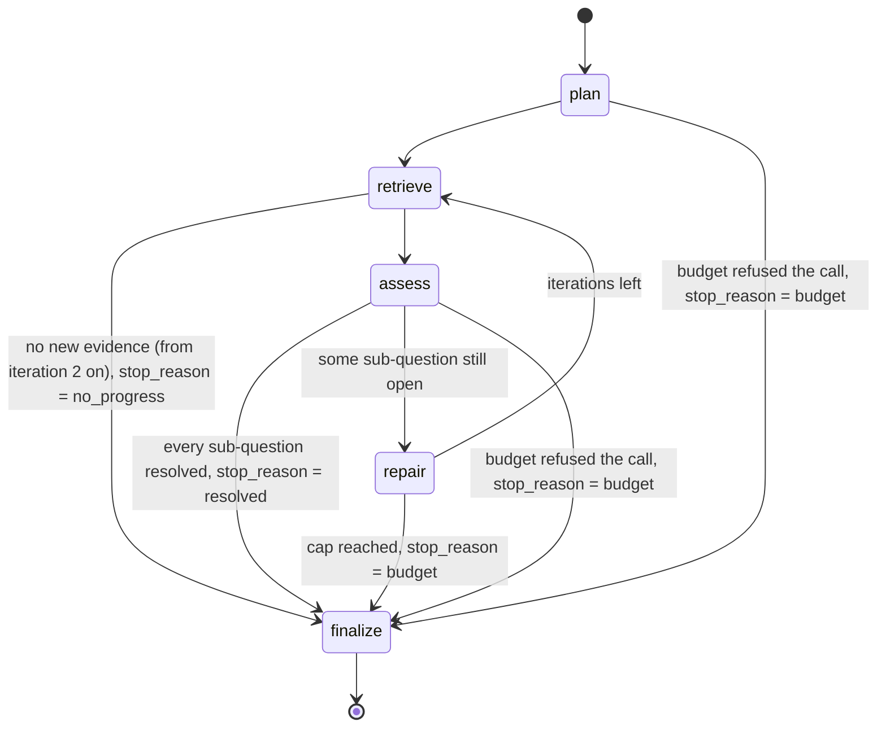

# Agentic RAG

> Status: **core implementation merged for v0.2.0** (Phase 5), release not yet cut.
> `AgenticRAGStrategy` (`packages/core/src/ragfabric_core/strategies/agentic.py`) runs a bounded
> loop over the agent package (`packages/core/src/ragfabric_core/agent/`) and is registered as
> `agentic` in `strategies/registry_defaults.py`, wrapping the same Traditional and Vectorless
> strategy instances the deployment already builds. It is **a plain Python state machine, not
> LangGraph** ([ADR 0009](adr/0009-plain-state-machine-over-langgraph.md)); the roadmap
> promised LangGraph and a spike measured the alternative before that promise was withdrawn.
>
> **Not yet selectable from outside core.** `POST /api/ask` and `POST /api/search/query` still
> validate `strategy` against `traditional|vectorless`, `ragfabric ask --strategy` offers the
> same two, and the Python SDK is unchanged. Exposing the agent over the API, the CLI and the
> SDK is the remaining Phase 5 work, as is generating a cited answer from the evidence the
> agent pools and returning the per sub-question report. Today the strategy returns the pooled
> evidence and a full trace through the standard `RetrievalResult` (ADR 0002).
>
> Retrieval quality (whether an answer is correct, complete or faithful to its sources) is
> **not measured**; Phase 8 measures it.

See [concepts/agentic-loops.md](concepts/agentic-loops.md) for the mental model, and
[ADR 0010](adr/0010-repair-policy-and-termination.md) for the repair policy and the three stop
conditions.

## What it does

```
question -> plan -> retrieve (open sub-questions only) -> assess (per sub-question)
         -> all resolved? yes: finalize
         -> no: repair (one of six moves per failed sub-question) -> retrieve again (bounded)
         -> stop on resolved, budget or no_progress, and record which
```

One model call decomposes the question into sub-questions and assigns a tool to each. Each
open sub-question is retrieved for with its own tool, and the results are pooled by chunk id.
One model call judges, per sub-question, whether the pooled evidence answers it. For each part
still unanswered, one model call chooses a repair move from a fixed set of six, the policy
applies it, and the loop retrieves again. It stops for one of exactly three reasons and says
which.

A question that resolves on the first pass costs two model calls in the loop today, one to plan
and one to assess, and a third when the generation node lands. Each further iteration adds one
assessment and one repair call per sub-question still open. The textbook design this replaced
spent six or more on the same question, and the saving comes from merging two nodes and
removing two others, described under "What was deliberately not built" below.

## Why it is needed

Some questions cannot be answered by one lookup. "Compare the 2025 and 2026 travel policies
and list what changed" needs two retrievals and a comparison. A question whose key term is an
error code needs a different ranking from one phrased the way a person speaks. A first
retrieval that comes back empty needs something other than the same search again.

A single-shot pipeline returns a partial answer, or a confident wrong one, and in neither case
says which part it failed on.

## How it works internally



| Concept | Meaning in this system |
|---|---|
| State | `AgentState`: the question, the sub-question ledger, the evidence pool keyed by chunk id, the call counters and the caps. Passed to each node and mutated by it |
| Node | A plain Python function that does one thing and returns a `TraceSpan`. It never decides what runs next |
| Branch | An `if` in `run_agent`. There is no edge object and no graph runner |
| Iteration | One pass of retrieve, assess and repair. Capped by `max_iterations`, default 4 |
| Tool call | `semantic_search`, `lexical_search` or `fetch_document`, chosen per sub-question by the plan and changeable by a repair |
| Stop reason | `resolved`, `budget` or `no_progress`, assigned at the branch that decides it and carried onto the finalize span |

### The nodes

- **plan** (`agent/nodes.py`, one model call): decomposes the question into the smallest number
  of sub-questions that can each be answered by one retrieval, and assigns a tool to each.
  A simple question yields exactly one sub-question; splitting "what is the retry limit"
  costs a retrieval per part and buys nothing. The list is capped at 6, duplicates that differ
  only in case or spacing are collapsed, and a tool the deployment does not run falls back to
  the first available of `semantic_search`, `lexical_search`, `fetch_document`. A plan that
  cannot be parsed falls back to a single sub-question over the whole question, which is what a
  plain retriever would have done anyway.
- **retrieve** (`agent/nodes.py`, no model call): runs each **open** sub-question's tool and
  pools what comes back by chunk id. Answered sub-questions are not retrieved for again, which
  is the entire reason the ledger exists. The outcome carries the chunk ids that were genuinely
  new, which is the progress signal.
- **assess** (`agent/nodes.py`, one model call): returns a per sub-question verdict against a
  deliberately pessimistic rubric. Evidence answers a sub-question only if the answer can be
  read directly out of the retrieved text; related is not answered, implied is not answered,
  and unsure is not answered. Two pessimistic readings are enforced in code rather than merely
  requested in the prompt: a verdict that claims answered while also naming something missing
  is read as not answered, and a sub-question the model did not judge at all stays open.
  Verdicts are matched back to the ledger by normalised text, and a verdict about a
  sub-question that was never asked is discarded rather than guessed at.
- **repair** (`agent/loop.py`, one model call per failed sub-question): asks for a move, and
  the policy decides whether the proposal is usable. The move is applied to the sub-question,
  the attempt is recorded with the query that failed and what was missing, and the loop
  retrieves again. Full policy in [ADR 0010](adr/0010-repair-policy-and-termination.md).
- **finalize**: not a function. `run_agent` appends the finalize `TraceSpan` carrying the stop
  reason, its detail, the iteration count, the size of the evidence pool and how many
  sub-questions ended answered or abandoned.

There is no `generate` node yet. `NodeName.GENERATE` and a `generate` per-node call cap exist
in the state and the configuration, and the node that writes a cited answer over the pooled
evidence is the remaining Phase 5 work. Until it lands, the strategy returns the evidence and
the trace, and generation happens in the same place it does for every other strategy.

### The tools

Tools are thin. They call the strategies that already exist and are already tested, so there is
one BM25 implementation and one vector implementation in the codebase.

| Tool | Wraps | Good at | Blind to |
|---|---|---|---|
| `semantic_search` | `TraditionalRAGStrategy` | Concepts, paraphrases, a policy described in other words, questions phrased the way a person asks them | Exact strings. An error code or a part number can be missed entirely, because a near-identical code looks almost the same to it |
| `lexical_search` | `VectorlessRAGStrategy` | Identifiers, error codes, versions, file names, quoted phrases, anything where a character out of place changes the answer | Paraphrase. A passage answering the question in different words is not found |
| `fetch_document` | `stores/document_chunks.py` | Returning one document whole, in reading order, when the fragments a search returns are not enough | Finding a document by describing it. It needs an id |

**Every tool is handed the caller's own `RetrievalContext`, filter included.** Nothing in the
agent rebuilds one. This matters more here than anywhere else in the system, because the agent
retrieves repeatedly and pools what it finds, and a single call made under the wrong filter
contaminates a pool that is later summarised into an answer.

`fetch_document` is the tool that has to be right about this. Every other read path is a ranked
search whose SQL already carries the predicate; this one names a document directly. The access
predicate goes into the WHERE clause of the read, so a denied document returns no rows from the
database rather than rows dropped in Python afterwards (ADR 0003). The document is returned
whole and never cut to `top_k`, because truncating it would defeat the reason the tool was
chosen over a search. Its chunks carry no score, since nothing was ranked and a number there
would be a fabricated relevance (ADR 0004).

A repair that widens `top_k` applies it with `model_copy` on the existing context, so the
principal and the access filter carry over untouched. Widening a search never widens access.

### Model decisions are JSON, not tool calls

`LLMProvider` exposes `complete` and `stream` and no tool-calling surface. Every decision the
agent delegates to a model comes back as JSON validated against a schema in `agent/contracts.py`.

This is not a workaround. It works on every provider including a 3B model running locally, it
lets a scripted test double return canned JSON and drive every branch offline with no network
and no database, and a malformed response becomes a typed `ContractViolation` the loop handles
rather than an exception that fails a request.

The parsers are forgiving about packaging and strict about content. A fenced code block,
a sentence of agreement before the JSON, or an explanation after it are all tolerated, because
small models emit them constantly and none of them is a real failure. A missing field, an empty
plan or an invented repair move is a real failure and returns a violation. Each node has a
defined answer to one: the plan falls back to a single sub-question, the assessment leaves
every sub-question open, and the repair lets the policy choose from the situation.

**A malformed response never crashes a request and is never silently counted as success.**

## Preventing infinite loops

| Limit | Default | Enforced by |
|---|---|---|
| `max_iterations` | 4 | `run_agent`, checked at the top of each pass. Stop reason `budget` |
| Global LLM call cap | `Budget.max_llm_calls`, 8 | `AgentState.spend`, which raises before the counter moves. Stop reason `budget` |
| Per-node LLM call caps | plan 2, assess 6, repair 6, generate 2 | `AgentState.spend`, so one runaway node cannot consume the whole budget before the others run. Stop reason `budget` |
| No repeat of a repair move on an unchanged sub-question | always | `agent/policy.py`. Without it the agent alternates broaden and narrow until the budget is gone |
| Sub-questions per plan | 6 | `agent/nodes.py`. Each one costs a retrieval on every iteration |
| No progress | always, from iteration 2 | `run_agent`, on the chunk ids the pool gained. Stop reason `no_progress` |

A refused spend leaves the state exactly as it was, so the loop finalizes on the evidence it
already has rather than on a half-applied step.

`strategies.agentic` in `ragfabric.yaml` also carries `max_cost_usd`, `max_latency_ms` and
`assess_strictness`. They are typed, validated and reported by `ragfabric config validate`, and
**the loop does not read them yet**. The same is true of `strategies.agentic.max_llm_calls`:
the cap the loop enforces is the one on the caller's `Budget`. Stated here rather than implied,
because a limit documented as enforced and not enforced is worse than one documented as
pending.

## What is tracked

Every counter on the result is read back off what happened, never derived from the shape of the
strategy (ADR 0004).

| Counter | Where it comes from |
|---|---|
| `llm_calls` | `AgentState.llm_calls`, the same counter the budget refuses against |
| `retrieval_calls` | One per tool invocation the loop actually made, not iterations times sub-questions |
| `embedding_calls` | Measured across the run from the tools themselves. `semantic_search` carries a counter and reports what it spent; `lexical_search` deliberately carries none, so an agent that only ever searched lexically reports zero because zero is what happened |
| `input_tokens`, `output_tokens` | Summed from the completions the nodes actually made |
| `latency_ms` | Wall clock around the run |
| `trace` | One `TraceSpan` per node, in order, plus the finalize span carrying the stop reason and its detail |

The pooled evidence is returned in full, best scored first with ties broken by chunk id, and is
deliberately **not** cut to `top_k`. The agent retrieved several times precisely because one
retrieval was not enough, and discarding the later halves of that work would make the extra
calls pointless. The context budget is applied at generation, where it is applied for every
strategy.

## What was deliberately not built

The previous version of this document described an eight-node design: `analyze`, `plan_need`,
`retrieve`, `evaluate_evidence`, `rewrite_query`, `generate`, `verify_answer`, `finalize`. It
was a reasonable skeleton and it is not what shipped.

| Node in the old design | What happened to it | Why |
|---|---|---|
| `analyze` and `plan_need` | Merged into one `plan` node | Two model calls doing adjacent work. Understanding the question and choosing how to answer it are the same judgement, and splitting them bought a second failure point on every request |
| `evaluate_evidence` | Became `assess`, judging **per sub-question** rather than globally | A global verdict cannot say which part is missing, so the next iteration re-retrieves everything and decomposition buys nothing |
| `rewrite_query` | Removed as a node. Rewriting is two of the six moves inside the repair policy | Promoting it to a node hardcodes the weakest repair as the only one |
| `verify_answer` | Not a new model call. The Phase 3 citation contract (`generate/contract.py`) already checks marker validity, quote fidelity and grounding | A second, LLM-based verifier would duplicate a mechanical check and add a judgement that can itself be wrong. The existing contract has already caught a real failure: a local `llama3.2:3b` streamed a correct answer with no citation marker and the contract repaired it |
| `best_effort` as a boolean | Replaced by per sub-question status and reasons | A boolean cannot say which part failed or why |

Conflict detection between passages was deferred on purpose. Semantic contradiction is a hard
inference task, a confident "these sources disagree" that is wrong is worse than silence, and
it cannot be tuned without measurement, which is Phase 8. What Phase 5 will carry instead is
the honest metadata subset, landing with the generation work: where two chunks answering the
same sub-question come from documents with different effective dates, both are surfaced with
their dates. That is a fact about metadata, not a judgement about meaning, and no part of it
is in the loop today.

## Alternatives and trade offs

| Alternative | Trade off |
|---|---|
| Single-shot Traditional RAG | Far cheaper and faster per question, fails on multi-part questions and cannot recover from a bad first retrieval |
| Query decomposition without a loop | Handles comparisons, still cannot recover from a bad first retrieval |
| A loop whose only repair is rewriting the query | One response to every failure. A paraphrase missed lexically, a sub-question that is still compound, and an answer spread across a whole policy all need something a rewrite cannot do |
| Fully autonomous agent with open-ended tools | More capable, unpredictable latency and cost, and untestable: the action space is whatever the model emits |
| LangGraph | Measured against this loop in a spike and rejected. See [ADR 0009](adr/0009-plain-state-machine-over-langgraph.md) |

The middle path, a fixed set of nodes with a bounded loop and a fixed set of repair moves, is
testable: a scripted model double drives every branch in unit tests with no network and no
database.

## Where it fails

- **The plan is only as good as the model.** A small model over-splits a simple question,
  which costs a retrieval per part, or under-splits a comparison, which leaves one retrieval
  trying to answer two things. The cap at 6 sub-questions and the deduplication bound the
  damage; they do not prevent it.
- **The assessment can be wrong in both directions.** Pessimistic by design, so its usual error
  is to keep looking when it already had the answer, which costs an iteration. The opposite
  error, marking a sub-question answered on topical evidence, is the one that reaches a caller
  wearing a citation, and it is the reason the rubric is strict and the contradictory verdict
  is read as not answered.
- **The mechanical query edits are dull by design.** When the model supplies no rewritten
  query, broadening drops qualifier words and cuts at a trailing preposition, and decomposition
  splits on a conjunction. These are list-and-string operations over fixed vocabularies. They
  are a floor under a model that returns nothing usable, not language understanding, and they
  will handle an unusual phrasing badly.
- **Latency is variable and higher than a single-shot strategy**, which is the cost of deciding
  how much work to do while doing it. The router in Phase 7 exists so this strategy is used
  only when a question needs it.
- **No quality figure exists.** Whether six moves recover more questions than one, and whether
  the agent retrieves better than the two strategies it wraps, are measurements. Per
  [ADR 0004](adr/0004-measurement-first-no-fabricated-numbers.md) no number for either appears
  anywhere in this repository until Phase 8 produces one.
