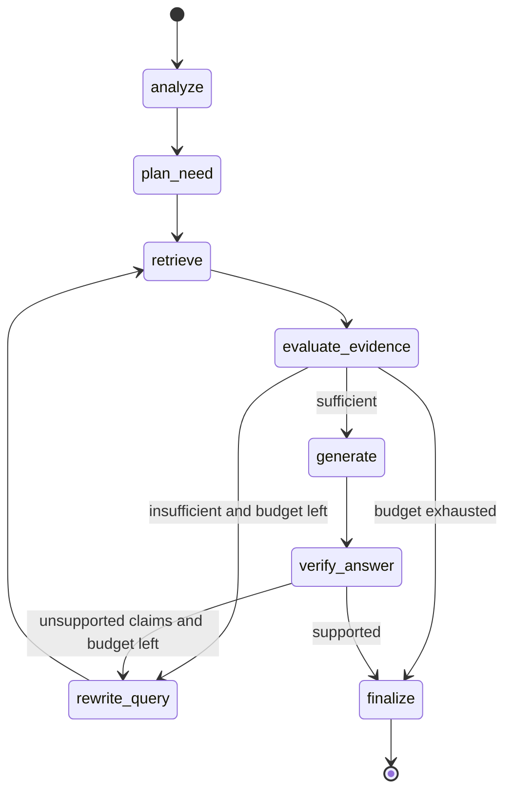

# Agentic RAG

> Status: concept complete. Implementation ships in **v0.2.0** using LangGraph.

## What it does

```
question -> analyze -> decide information need -> retrieve (tools) -> evaluate evidence
        -> enough? no: rewrite query -> retrieve again (bounded) | yes: generate -> verify -> answer
```

Instead of one retrieval and one answer, an agent plans what to look for, retrieves, judges whether the
evidence is sufficient, refines its query when it is not, and verifies the final answer against the
evidence. The loop is bounded by an iteration and cost budget.

## Why it is needed

Some questions cannot be answered by one lookup: "compare the 2025 and 2026 travel policies and list what
changed" needs two retrievals and a comparison; a vague question needs to be sharpened before it can be
searched. A single shot pipeline either returns a partial answer or fails silently.

## How it works internally

Built as an explicit state machine with LangGraph.

| Concept | Meaning in this system |
|---|---|
| State | A typed object carried between steps: question, sub questions, retrieved evidence, evaluations, rewrites, draft answer, counters for calls, tokens and cost |
| Node | A function that reads state and returns updates: `analyze`, `plan_need`, `retrieve`, `evaluate_evidence`, `rewrite_query`, `generate`, `verify_answer`, `finalize` |
| Edge | A fixed transition between nodes |
| Conditional edge | A transition chosen at runtime: after `evaluate_evidence`, go to `generate` if evidence is sufficient, to `rewrite_query` if not, to `finalize` with a best effort flag if the budget is exhausted |
| Iteration | Each pass through retrieve and evaluate; capped by `max_iterations` |
| Tool call | The `retrieve` node calls `semantic_search`, `lexical_search` or `fetch_document`, chosen by the analyzer |



### The nodes

- **analyze**: classifies the question, extracts constraints (dates, entities, comparison targets),
  decomposes into sub questions when needed.
- **plan_need**: decides which tool suits each sub question. Identifiers go to lexical search, concepts
  to semantic search, "the whole policy" to fetch document.
- **retrieve**: executes the tool calls with the caller's access filter, appends evidence to state.
- **evaluate_evidence**: an LLM call with a strict rubric: does the evidence answer each sub question,
  what is missing. Returns a structured verdict, not prose.
- **rewrite_query**: produces a sharper or alternative query for the missing part, using what was
  learned. Never repeats a query already tried.
- **generate**: writes the answer from evidence only, with numbered citations.
- **verify_answer**: checks each claim against the cited evidence; unsupported claims trigger one more
  loop or are removed.
- **finalize**: assembles the result, the trace and the metrics, and marks `best_effort=true` if the
  budget stopped the loop.

## Preventing infinite loops

`max_iterations` (default 4), a cost budget in estimated USD, a wall clock budget, and a rule that a
rewritten query must differ from all previous queries. When any budget trips, the agent finalizes with
what it has and says so.

## What is tracked

Agent steps, retrieval calls, LLM calls, input and output tokens, estimated cost, latency per node, and
a trace of every node's inputs and outputs summary. The Trace page shows the path taken.

## Alternatives and trade offs

| Alternative | Trade off |
|---|---|
| Single shot Traditional RAG | Ten times cheaper and faster, fails on multi part questions |
| Query decomposition without a loop | Handles comparisons, cannot recover from a bad first retrieval |
| Fully autonomous agent with open ended tools | More capable, unpredictable latency and cost, hard to test |

The middle path here, a fixed graph with a bounded loop, is testable: a scripted LLM double can drive
every branch in unit tests.

## Where it fails

Loops that stop too early with a wrong answer, or too late having spent the budget; evaluation calls
that are themselves wrong; latency that users will not wait for on simple questions. The router exists
so this strategy is used only when needed.
