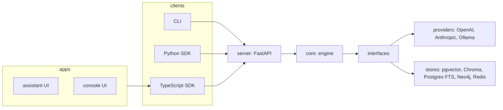
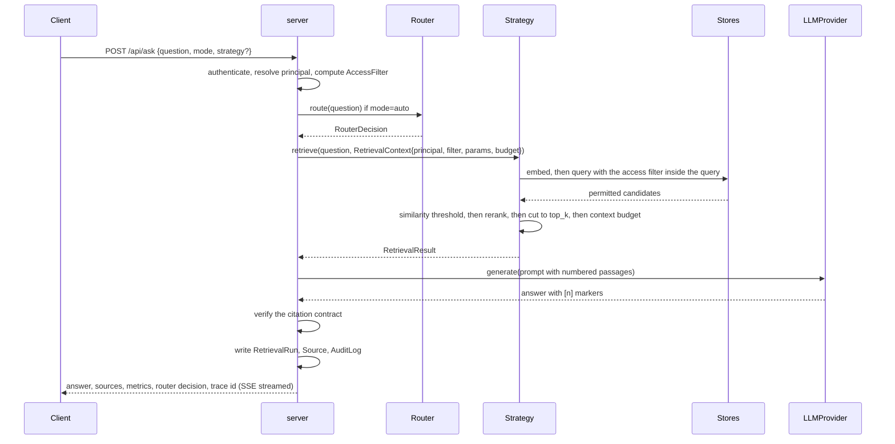

# Architecture

> Status: design approved 2026-09-13, implemented progressively from v0.1.0. The v1 code on `main`
> maps onto this design as described in the migration section.

## Layers



Dependency direction is one way. `core` never imports from `server`; `server` never imports from an
app; apps never call the API without the SDK. CI enforces this with import linting.

## Packages

| Package | Responsibility | Depends on |
|---|---|---|
| `packages/core` | Strategies, router, ingestion, evaluation, access policy, tracing hooks, all interfaces | nothing in the repo |
| `packages/server` | FastAPI app: auth, REST, SSE streaming, admin endpoints, trace and metrics endpoints | core |
| `packages/cli` | `ragfabric` command | core, and the server over HTTP when running |
| `packages/sdk-python` | Typed client generated from the OpenAPI spec | nothing |
| `packages/sdk-typescript` | Same, published as `@ragfabric/sdk` | nothing |
| `apps/console` | Admin: users, groups, collections, grants, API keys, providers, dashboards | sdk-typescript |
| `apps/assistant` | Reference end user UI: Ask, Compare, Trace, Sources | sdk-typescript |

## Request flow



For Traditional RAG, shipped in Phase 3, the flow is concretely: authenticate and resolve the
principal, compute the `AccessFilter`, embed the question, query the configured vector store with the
access filter passed inside the query itself (not applied afterward), drop candidates below
`similarity_threshold`, optionally rerank, cut to `top_k`, fit the survivors to the context token
budget, generate the answer, verify it against the citation contract (regenerating once, transparently,
if it fails), and write the `RetrievalRun`, its `Source` rows and an `AuditLog` entry.

Phase 2 already implemented the access filter and audit half of this flow on `/api/search/query`,
`/api/search/semantic` and `/api/search/hybrid`, though at the time those routes ran against the v1 in
memory index rather than a real vector store. Phase 3 replaced that index with the pgvector or Chroma
query above, kept `/api/search/query`'s response shape unchanged, and added `POST /api/ask` with the
router hook (the router itself, and AUTO mode, still arrive in Phase 7; `/api/ask` runs MANUAL mode
today) and SSE streaming.

## Core types

```python
class RetrieverStrategy(Protocol):
    name: StrategyName
    def retrieve(self, query: str, ctx: RetrievalContext) -> RetrievalResult: ...

class RetrievalContext(BaseModel):
    principal: Principal
    access_filter: AccessFilter          # permitted document ids, computed once per request
    collection_ids: list[str] | None
    params: StrategyParams               # top_k, similarity_threshold, ...
    budget: Budget                       # max llm calls, max latency, max cost

class RetrievalResult(BaseModel):
    strategy: StrategyName
    chunks: list[RetrievedChunk]
    retrieval_calls: int
    llm_calls: int
    input_tokens: int
    output_tokens: int
    latency_ms: int
    trace: list[TraceSpan]
    fallback_from: StrategyName | None = None
```

Generation, citation checking, metrics and evaluation never inspect `strategy`. That is what makes the
four strategies comparable.

## Data model

| Table | Purpose |
|---|---|
| users, groups, group_members | Identity and grouping |
| collections, collection_grants, document_overrides | Access control |
| api_keys | Hashed keys with scopes and rate limits |
| documents, chunks | Content with page, section, span, document_type, storage_path |
| chunk_embeddings, chunk_search | pgvector column and `tsvector` column per chunk, fed by ingestion since Phase 2, queried by Traditional RAG since Phase 3 |
| entities, relationships | Mirror of the graph for the console; Neo4j is the query engine |
| conversations, messages | Chat history |
| retrieval_runs, sources | One row per query with metrics; sources returned and sources filtered |
| evaluation_runs, evaluation_results | Benchmark runs and per question results |
| audit_log | Who asked what, which strategy, what was filtered |

21 tables in total as of migration 0003. Vector data lives in `chunk_embeddings` (pgvector, or a NumPy
column on SQLite) or Chroma, lexical data in `chunk_search` (`tsvector`, or a token overlap fallback on
SQLite) or an in process BM25 index rebuilt from `chunks`, graph data in Neo4j.

`chunks`, `chunk_embeddings` and `chunk_search` each carry their own denormalised `collection_id`,
which is what lets the access predicate apply inside the store query with no join back to `documents`
(ADR 0003). `POST /api/documents/{id}/move` (Phase 3, owner or admin, the destination collection's
visibility checked the same way a read is) updates all three inside one transaction when a document
changes collection, so no reader ever observes a document whose own row names one collection while its
index rows still name another. This covers the relational tables only: a Chroma vector store keeps its
own copy of `collection_id` in its external metadata store, outside this transaction, and is not
touched by a move.

## Ingestion

```
file -> parser -> cleaning -> metadata -> chunker -> document_chunks
     -> schedule_indexing: inline (same process) | queue (Redis, background workers)
     -> fan out: vector index (chunk_embeddings) | lexical index (chunk_search) | graph queue (extraction, placeholder)
```

Shipped in Phase 2: `ingest/clean.py` (hyphenation repair, whitespace, repeated header and footer
removal, heading detection), the retained original under `uploads_dir`, and
`ingest/indexing.schedule_indexing`, which writes to both the vector and lexical index in one job, now
atomically across both stores (Phase 3). Workers are stateless and horizontally scalable; the API never
blocks on indexing in `queue` mode. `ragfabric reconcile` (Phase 3) retries a document stuck in
`indexing` past a grace period after a crashed fan out; its documented limitation is that a merely slow
document, not a crashed one, can be re-run while a worker is still processing it, so the safe procedure
is to stop the worker(s) first.

## Observability

One trace per request. Spans: router, each retrieval call, each LLM call, generation, citation check,
each agent node, each graph traversal. Spans carry latency; LLM spans carry tokens and cost. Stored in
PostgreSQL for the built in Trace page and dashboards; exported over OTLP when configured.

## Migration from the v1 layout

The move from the v1 `backend/` and `frontend/` layout to the monorepo happened in Phase 1. The v1
ingestion, retrieval, generation and store code now lives in `packages/core`; the v1 API, security and
dependency wiring in `packages/server`; the v1 Angular app in `apps/assistant`. The hashing embedder and
extractive generator are kept as offline test doubles. `packages/core/src/ragfabric_core/` today:

```
ragfabric_core/
  auth/            principal.py (Principal, AccessFilter), base.py (AuthProvider),
                   service.py (groups, members, grants, overrides), policy.py (compute_access_filter),
                   api_keys.py (rf_ keys, hashing, expiry), ratelimit.py (check_rate_limit)
  connectors/      base.py (SourceDocument, Connector)
  db/              migrate.py, session.py
  embeddings/      normalise.py (L2 normalisation, applied once at write time)
  generate/        answer.py, llm.py, cited.py (generate_cited_answer, build_prompt), contract.py
                   (assert_citation_contract, the mechanical citation check)
  ingest/          chunk.py, clean.py (cleaning, heading detection, document_type_for), embed.py,
                   indexing.py (schedule_indexing), parser.py, pipeline.py, reindex.py (batched
                   re-embedding under the active model), storage.py (retained originals)
  migrations/      alembic.ini, env.py, script.py.mako, versions/0001_initial_schema.py,
                   versions/0002_platform_tables.py, versions/0003_ingestion_and_indexes.py,
                   versions/0004_pin_vector_dim_and_hnsw.py, versions/0005_ingestion_runs.py,
                   versions/0006_timezone_aware_timestamps.py
  models/          base.py, user.py, document.py, access.py, runs.py, evaluation.py, graph.py, index.py
  providers/       base.py, offline.py, openai_compat.py, anthropic_provider.py, registry.py
  queue/           base.py (Job, JobQueue), memory_queue.py, redis_queue.py, registry.py (build_queue)
  rerank/          base.py (Reranker, all_finite, rescore_and_sort), noop.py, llm_reranker.py
                   (LlmReranker, candidate cap against silent prompt truncation), cross_encoder.py
                   (ragfabric[rerank] extra, lazy model load), registry.py
  runtime.py       get_config, reset_config, get_session_factory
  stores/          base.py (VectorStore, LexicalStore, GraphStore, Cache), pgvector_store.py,
                   postgres_fts.py, chroma_store.py (Chroma, access predicate inside the query),
                   memory_cache.py, redis_cache.py, access_sql.py (access_clause), registry.py
  strategies/      base.py (StrategyName, RetrievedChunk, TraceSpan, StrategyParams, Budget,
                   RetrievalContext, RetrievalResult, RetrieverStrategy, StrategyRegistry),
                   contract.py, traditional.py (TraditionalRAGStrategy), registry_defaults.py
  telemetry/       tracing.py (start_trace, trace, configure_otel, otel_enabled)
  testing/         fixtures.py
  tokens.py        exact (tiktoken) or estimated token counts, fit_to_budget (drops whole chunks)
  workers/         handlers.py (index_document, extract_graph, reconcile_stuck_indexing),
                   runner.py (Worker, default_handlers)
  config.py        environment Settings
  config_file.py   ragfabric.yaml loader, strict validation
  pricing.py       pricing.yaml    dated, sourced cost data
  security.py
  __init__.py
```

`store/` (the v1 in memory index) and `retrieve/` (the v1 retrievers) existed through Phase 2 and are
deleted in Phase 3, along with `strategies/legacy.py` (`LegacyHybridStrategy`); none of the three exist
in the tree above. `packages/sdk-python` (`ragfabric_sdk`), the Python client, is created in Phase 3: it
talks HTTP only and never imports `ragfabric_core`, so an adopter can install it without pulling in the
server's dependency tree.
