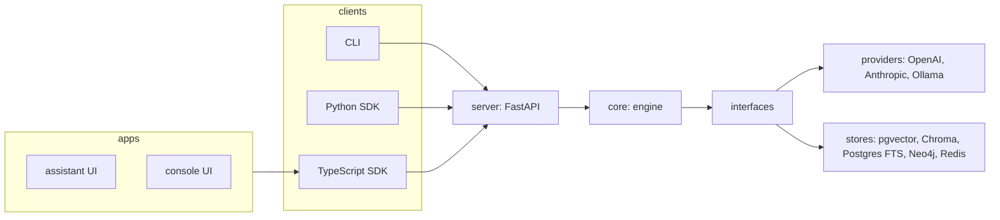
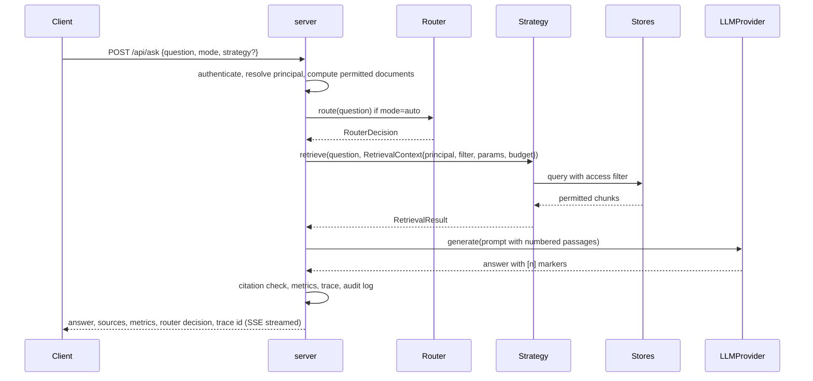

# Architecture

> Status: design approved 2026-09-13, implemented progressively from v0.1.0. The v1 code on `main`
> maps onto this design as described in the migration section.

## Layers



Dependency direction is one way. `core` never imports from `server`; `server` never imports from an
app; apps never call the API without the SDK. CI enforces this with import linting.

## Packages

| Package | Responsibility | Depends on |
|---|---|---|
| `packages/core` | Strategies, router, ingestion, evaluation, access policy, tracing hooks, all interfaces | nothing in the repo |
| `packages/server` | FastAPI app: auth, REST, SSE streaming, admin endpoints, trace and metrics endpoints | core |
| `packages/cli` | `ragfabric` command | core, and the server over HTTP when running |
| `packages/sdk-python` | Typed client generated from the OpenAPI spec | nothing |
| `packages/sdk-typescript` | Same, published as `@ragfabric/sdk` | nothing |
| `apps/console` | Admin: users, groups, collections, grants, API keys, providers, dashboards | sdk-typescript |
| `apps/assistant` | Reference end user UI: Ask, Compare, Trace, Sources | sdk-typescript |

## Request flow



## Core types

```python
class RetrieverStrategy(Protocol):
    name: StrategyName
    def retrieve(self, query: str, ctx: RetrievalContext) -> RetrievalResult: ...

class RetrievalContext(BaseModel):
    principal: Principal
    access_filter: AccessFilter          # permitted document ids, computed once per request
    collection_ids: list[str] | None
    params: StrategyParams               # top_k, similarity_threshold, ...
    budget: Budget                       # max llm calls, max latency, max cost

class RetrievalResult(BaseModel):
    strategy: StrategyName
    chunks: list[RetrievedChunk]
    retrieval_calls: int
    llm_calls: int
    input_tokens: int
    output_tokens: int
    latency_ms: int
    trace: list[TraceSpan]
    fallback_from: StrategyName | None = None
```

Generation, citation checking, metrics and evaluation never inspect `strategy`. That is what makes the
four strategies comparable.

## Data model

| Table | Purpose |
|---|---|
| users, groups, group_members | Identity and grouping |
| collections, collection_grants, document_overrides | Access control |
| api_keys | Hashed keys with scopes and rate limits |
| documents, document_chunks | Content with page, section, span, document_type |
| entities, relationships | Mirror of the graph for the console; Neo4j is the query engine |
| conversations, messages | Chat history |
| retrieval_runs, sources | One row per ask with metrics; sources returned and sources filtered |
| evaluation_runs, evaluation_results | Benchmark runs and per question results |
| audit_log | Who asked what, which strategy, what was filtered |

Vector data lives in pgvector or Chroma, lexical data in a `tsvector` column or an in process BM25
index rebuilt from `document_chunks`, graph data in Neo4j.

## Ingestion

```
file -> parser -> cleaning -> metadata -> chunker -> document_chunks
     -> fan out (Redis queue, background workers): embed+vector index | lexical index | graph extraction
```

Workers are stateless and horizontally scalable. The API never blocks on indexing.

## Observability

One trace per request. Spans: router, each retrieval call, each LLM call, generation, citation check,
each agent node, each graph traversal. Spans carry latency; LLM spans carry tokens and cost. Stored in
PostgreSQL for the built in Trace page and dashboards; exported over OTLP when configured.

## Migration from the v1 layout

| v1 | RagFabric |
|---|---|
| `backend/app/ingest`, `retrieve`, `generate`, `store` | `packages/core` |
| `backend/app/api`, `core/security`, `deps`, `main` | `packages/server` |
| `backend/tests` | split by package |
| `frontend` | `apps/assistant`, with the admin pages moving to `apps/console` |
| hashing embedder, extractive generator | kept as offline test doubles in core |
