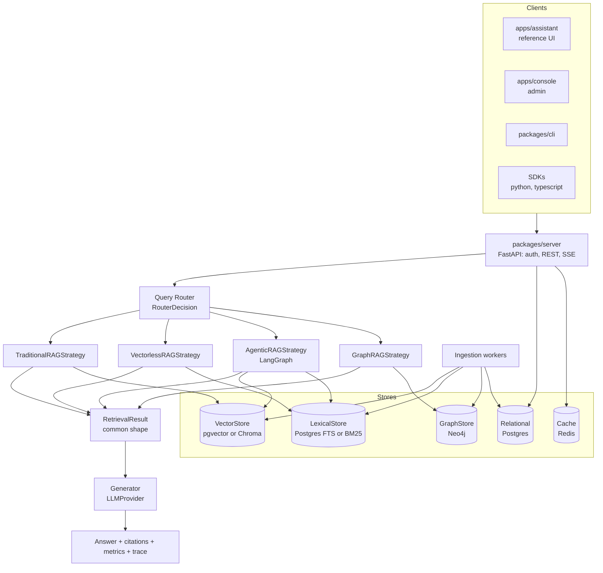

# RagFabric design (v2 of this repository)

Status: approved for planning, 2026-09-13. Implementation tracked in [ROADMAP.md](../../ROADMAP.md).

## 1. Purpose

RagFabric is a self hosted, open source RAG platform whose distinguishing feature is measurement.
A company points it at its documents, runs the same questions through four retrieval strategies
(Traditional, Agentic, Graph, Vectorless), sees real accuracy, latency, token and cost numbers for each,
and then runs the winner behind a router that picks a strategy per question. Everything around that core
(providers, stores, auth, UI, hosting) is replaceable so adopters keep their own infrastructure.

The project is also a teaching codebase: every non-obvious component carries a written explanation of
what it does, why it exists, what the alternatives were and which trade-off was taken.

## 2. Non-goals for v0.1 to v0.3

Multi-tenant SaaS, hosted service, fine tuning, model training, a chat product with memory features,
supporting every vector database on day one.

## 3. Architecture



Dependency direction is strict: apps depend on SDKs, SDKs on the HTTP contract, server on core, core on
its own interfaces. Provider and store implementations depend on core interfaces, never the reverse.

## 4. Repository layout

```
packages/core            engine: strategies, router, ingestion, evaluation, access policy, interfaces
packages/server          FastAPI application
packages/cli             ragfabric command
packages/sdk-python      typed client
packages/sdk-typescript  typed client, published as @ragfabric/sdk
apps/console             Angular admin console
apps/assistant           Angular reference end user UI, meant to be restyled or replaced
deploy/compose           lite and full profiles
deploy/k8s               later
evaluation               corpus, questions.json, runner, latest results
docs                     concepts, guides, ADRs, design docs, benchmarks
examples                 minimal integrations
```

Phase 1 placed the compose file at the repository root and the images under deploy/docker.

Migration path from the v1 layout: `backend/app` moves into `packages/core` and `packages/server`,
`frontend` becomes `apps/assistant`, tests move with their code. This happens in Phase 1 in one PR so
history stays followable.

## 5. Core interfaces

```python
class RetrieverStrategy(Protocol):
    name: StrategyName
    def retrieve(self, query: str, ctx: RetrievalContext) -> RetrievalResult: ...

class RetrievalResult(BaseModel):
    strategy: StrategyName
    chunks: list[RetrievedChunk]          # text, chunk_id, document_id, page, section, score, metadata
    retrieval_calls: int
    llm_calls: int
    input_tokens: int
    output_tokens: int
    latency_ms: int
    trace: list[TraceSpan]
    fallback_from: StrategyName | None = None

class RetrievalContext(BaseModel):
    principal: Principal                   # who is asking; drives the access filter
    collection_ids: list[str] | None
    params: StrategyParams                 # top_k, similarity_threshold, ... per request overrides
    budget: Budget                         # max llm calls, max latency, max cost
```

Provider and store interfaces: `LLMProvider`, `EmbeddingProvider`, `Reranker`, `VectorStore`,
`LexicalStore`, `GraphStore`, `Cache`, `AuthProvider`, `Connector`. Each ships with at least two
implementations in v0.1 so the abstraction is exercised, not decorative.

## 6. Configuration

One `ragfabric.yaml` (providers, stores, strategies, router, limits) plus environment variables for
secrets. Pricing lives in `pricing.yaml` and every cost figure is labelled an estimate from configured
pricing. The CLI validates configuration and reports which implementations are active.

## 7. Access control

| Concept | Rule |
|---|---|
| Workspace roles | admin, editor, viewer |
| Groups | Users belong to groups; groups receive `read` or `write` grants on collections |
| Document overrides | A document may be restricted below its collection |
| API keys | Hashed, scoped to collections and strategies, rate limited, tied to a principal |
| Enforcement | The principal's allowed document set is computed once per request and passed as a filter into every store query. Ranking happens only over permitted chunks |
| Audit | Every run records principal, question, strategy, sources returned, sources filtered by policy |

## 8. Observability

One trace per request. Spans: router, each retrieval call, each LLM call, generation, citation check,
each agent node, each graph traversal. Every span carries latency, and LLM spans carry tokens and cost.
Stored in Postgres for the built in Trace and dashboard pages; exported over OTLP when configured.

## 9. Evaluation

Shipped synthetic corpus (company policies for two years, org chart, project notes) and `questions.json`
in eight categories. Retrieval metrics against expected sources; generation metrics by a fixed rubric
LLM judge plus a deterministic citation check. `make eval` runs all strategies, persists results, and
regenerates `docs/benchmarks/latest.md` with commit, models and date. Nothing in docs is typed by hand.

## 10. Router

Two stage: cheap signals (identifiers, quoted phrases, entity count, comparison and aggregation words,
question length) then a small classification call. Produces `RouterDecision{selected_strategy,
confidence, reasoning, query_type, estimated_complexity, expected_cost_level, expected_latency_level}`.
Reasoning is a one sentence user safe explanation, never chain of thought. Fallback chain when evidence
is empty or confidence is low; `fallback_from` is recorded.

## 11. Releases

| Release | Theme | Phases |
|---|---|---|
| v0.1.0 | Initial RAG engine | 1 to 4 |
| v0.2.0 | Agentic retrieval | 5 |
| v0.3.0 | Graph retrieval | 6 |
| v0.4.0 | Adaptive router | 7 |
| v0.5.0 | Evaluation framework | 8 |
| v1.0.0 | Production release | 9 and 10 |

Semantic versioning, tagged releases with generated changelogs, container images on GHCR.

## 12. Open questions

- Community summaries for Graph RAG global questions: in v0.2 or later.
- Whether the console and assistant stay two Angular apps or merge behind role based navigation.
- OIDC provider choice for v0.3.
