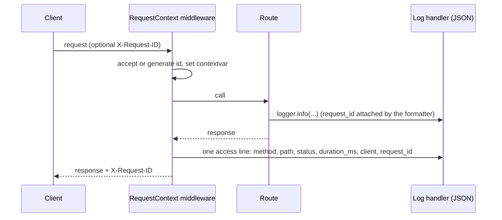
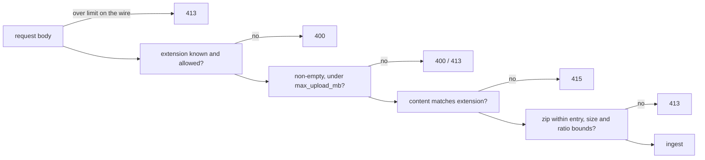
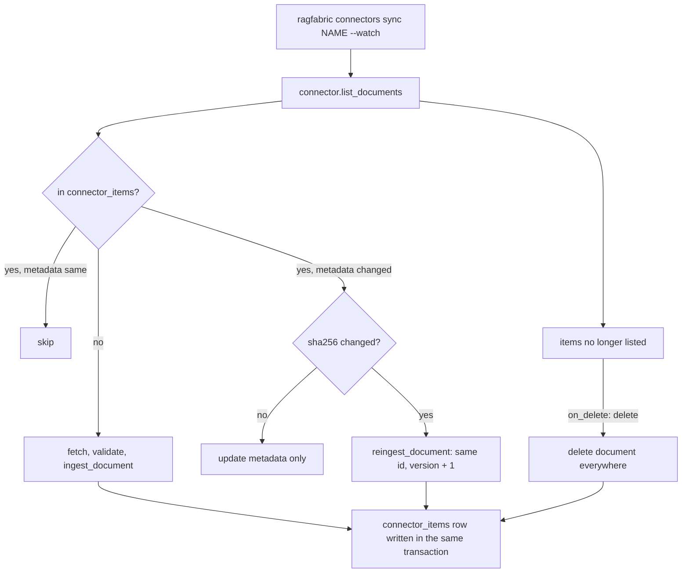
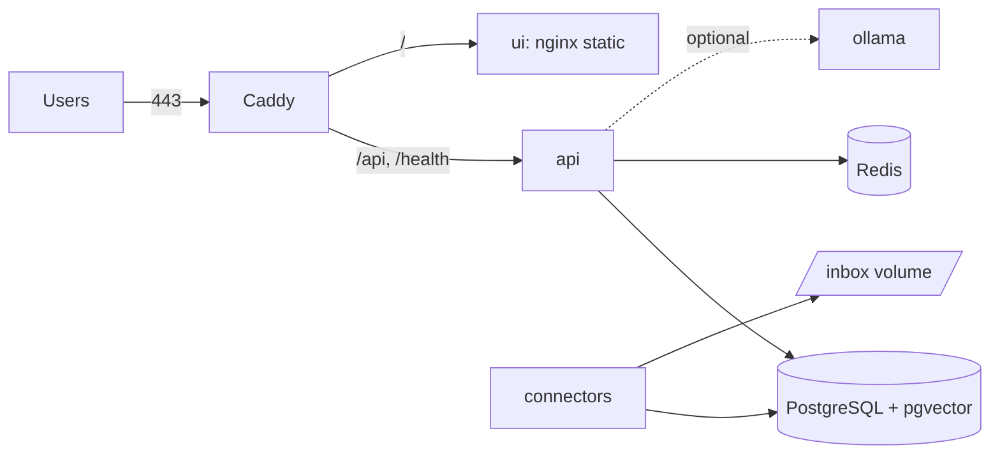

# Phase 10: hardening, connectors, docs site, deployment. Design

**Issue:** https://github.com/ranjan-del/ragfabric/issues/11

**Branch:** `feat/phase-10-hardening`, cut from `main` at `c9d5035`.

**Release:** none. v1.0.0 moved to Phase 11 (issue #52), so this phase tags nothing, publishes
nothing and deploys nothing. Everything it adds that could publish (the docs site deploy, the PyPI
upload) is built switched off, and the owner switches it on.

**Siblings in flight:** Phase 8 (`feat/phase-8-evaluation`) and Phase 9
(`feat/phase-9-assistant-sdk`) are separate, unmerged branches. This phase is built against `main`
and depends on neither. Where its work naturally reaches into theirs, the overlap is listed under
"Follow-ups after Phases 8 and 9 merge" rather than built here.

---

## Goal

Someone can run RagFabric for other people: on one machine with one command, behind HTTPS, with
documents arriving from a folder or a Google Drive, with abuse bounded, every request traceable in
the logs, and a documentation site that explains it. And the whole path from upload to cited answer
is proved by a test that runs offline in CI on every pull request.

---

## What issue #11 says, and what is stale

Issue #11 was written on 2026-09-13. Three of its lines no longer hold, and the issue should be
edited when this phase merges (the draft is kept outside the repository).

| Line in #11 | Status | Why |
|---|---|---|
| "release v1.0.0" in the title | Stale | v1.0.0 moved to Phase 11 (#52, PR #51). This phase tags nothing |
| "Repository rename to ragfabric" | Done | Renamed on 2026-09-13; the old URL redirects |
| "Tag v0.3.0" | Done, and misplaced | v0.3.0 was tagged at the end of Phase 6; v0.4.0 has since shipped too |
| "Firebase Hosting for UIs" | Generalised | The UI is a static bundle that needs `/api` on the same origin. The guide covers any static host that can proxy, Firebase Hosting included, and says which cannot |
| "Screenshots and demo GIF" | Deferred | Phase 9 replaces the reference UI. Screenshots of the UI it is about to replace would be stale on arrival |
| "First production deployment" | Not a code item | A deployment is an operator act on real infrastructure. This phase ships the guides and a verified single-VM stack; running one for real is the owner's step |
| "GHCR images" | Already done | `release.yml` has built and pushed the API, worker and UI images on every `v*` tag since v0.1.0 |

---

## What already exists (and changes the shape of the work)

| Area | Found on `main` | Consequence |
|---|---|---|
| Rate limiting | A fixed-window counter on the `Cache` interface, applied to API keys only, in `get_principal` | Signed-in users and the login endpoint have no limit at all. INCR then EXPIRE are two round trips, so a crash between them leaves a key with no expiry |
| File validation | Extension allow-list, `limits.allowed_types`, `limits.max_upload_mb`, empty-file check | The size is checked after the whole body has been parsed and read into memory. Nothing checks that the bytes are what the extension claims. A `.docx` is a zip, and nothing bounds what it inflates to |
| Logging | Plain `logging.getLogger` calls; `basicConfig` in the worker only | No request id, no JSON, nothing ties a log line to the request or the retrieval run that produced it |
| Connectors | `connectors/base.py`: a `Connector` protocol (`list_documents`, `fetch`) and `SourceDocument`, with no implementation | The interface is a good fit and is kept |
| Release | `release.yml` builds GHCR images on `v*` tags. Version bumps are hand edits across five files | Every release so far has needed a follow-up for a missed pin |
| Docs | 13 ADRs, 8 concept pages, per-strategy guides, all plain Markdown with Mermaid blocks | A site generator that reads `docs/` as it is costs no rewriting |
| Deployment | `docker-compose.yml` for development, loopback-bound, with development secrets | Nothing for a public host: no TLS, no proxy, no production config |

---

## Decisions

Each decision has its reason. Rejected options follow in their own table.

| # | Decision | Reason |
|---|---|---|
| D1 | **Request ids in a pure ASGI middleware**, not `BaseHTTPMiddleware` | `BaseHTTPMiddleware` buffers and re-wraps streaming responses and does not carry context variables across into the endpoint reliably. `/api/ask` streams Server-Sent Events, which is exactly the case it handles badly |
| D2 | **Accept a caller's `X-Request-ID` only if it is 1 to 128 characters of `[A-Za-z0-9._-]`**, otherwise generate a fresh one; echo it on every response | A proxy or a client that already has a correlation id keeps it end to end. The character rule stops a header from injecting newlines or JSON into the log stream |
| D3 | **Structured logging on the standard library**, a ~60 line JSON formatter in `ragfabric_core/telemetry/logs.py`, not `structlog` | Every library RagFabric uses (uvicorn, SQLAlchemy, httpx, the provider SDKs) already logs through `logging`. One formatter on the root handler makes all of them JSON with the request id attached. `structlog` would need a bridge for them anyway, and adds a dependency for no extra capability here |
| D4 | **Log format is configuration**: `logging.format: text` or `json` and `logging.level` in `ragfabric.yaml`, overridable by `RAGFABRIC_LOG_FORMAT` and `RAGFABRIC_LOG_LEVEL`. Default `text`; the production compose sets `json` | Someone running `ragfabric serve` on a laptop wants readable lines. A log shipper wants one JSON object per line. The environment override lets a container switch format without editing a mounted file |
| D5 | **One access log line per request from the middleware**, with method, path (never the query string), status, duration, client address and request id. uvicorn's own access log is turned off when the format is JSON | Two access lines per request in two formats is noise. Query strings can carry tokens, so they are not logged |
| D6 | **An unhandled error returns `{"detail": "Internal server error", "request_id": ...}`** and logs the traceback under that id | A user can quote the id, and the operator finds the one traceback that matters. The response never carries the exception text |
| D7 | **Rate limiting stays a fixed one-minute window on the existing `Cache` interface**, made atomic on Redis (INCR and EXPIRE in one transaction) | It already exists, it is tested, and a fixed window is cheap and predictable. A sliding window or token bucket is more precise at the window edge, where the worst case is twice the limit for one second; that is acceptable for capacity protection, and it is documented |
| D8 | **Three subjects, each with its own limit**: API keys (`rate_limit_per_minute` per key, as today), signed-in users (`limits.user_rate_limit_per_minute`, default 120) and unauthenticated auth attempts per client address (`limits.auth_attempts_per_minute`, default 10, on login and register) | Today a signed-in user is unlimited, and login is the one endpoint that most needs a limit, because it is where passwords are guessed |
| D9 | **A request is charged once**, however many dependencies resolve the caller | Routes that depend on both `get_current_user` and `get_access_filter` resolve the caller twice. Charging twice would halve every user's real limit |
| D10 | **429 carries `Retry-After`** (seconds to the next window), `X-RateLimit-Limit` and `X-RateLimit-Remaining`; the body stays `{"detail": "Rate limit exceeded"}` | Clients, the SDK and proxies can back off correctly rather than retrying blind. Keeping the body unchanged means no existing client breaks |
| D11 | **If the limiter's store is unreachable, the request is allowed** and an ERROR line is logged with the request id | Rate limiting protects capacity, not data. An outage of Redis should not become an outage of the API. Access control is unaffected because it does not live in the cache. Password guessing stays slow because bcrypt is slow by design. The trade-off is written down in the deployment guide |
| D12 | **Client address comes from the ASGI scope**, which uvicorn fills from `X-Forwarded-For` only when the peer is in `FORWARDED_ALLOW_IPS` | Parsing `X-Forwarded-For` ourselves would let any client pick its own address and dodge the auth limit. uvicorn's proxy handling is the one place to configure trust; the guides set it for Caddy |
| D13 | **Upload validation moves into core** (`ragfabric_core/ingest/validate.py`), used by the API, `ragfabric ingest` and every connector | Three entry points with three copies of the rules would drift. Today the CLI and the future connectors would accept a file the API refuses |
| D14 | **Content must match the extension**: PDF starts with `%PDF-`; DOCX and PPTX are zip files containing `word/document.xml` or `ppt/presentation.xml`; TXT, MD and CSV decode as UTF-8 and contain no NUL byte. A mismatch is HTTP 415 | An extension is a claim by the uploader. A mismatch would otherwise reach a parser that was never meant to see those bytes, and fail there with a less useful error. 415 is the status for "this media type is not what I accept"; the existing 400 for an unknown extension is kept so no client breaks |
| D15 | **Zip containers are bounded before parsing**: total uncompressed size at most `limits.max_uncompressed_mb` (default 200), at most 10,000 entries, and a compression ratio no higher than 100 to 1 | A 1 MB `.docx` can inflate to gigabytes. The central directory states the sizes, so this check costs no decompression |
| D16 | **Upload size is enforced on the wire**, by an ASGI middleware that counts the request body on the upload path and stops at the limit plus 1 MB for multipart overhead, and by checking `Content-Length` first | Today the multipart parser spools the whole body to disk before the handler sees it. A 10 GB upload is written to disk and then rejected |
| D17 | **Connectors are a sync engine in core over the existing `Connector` protocol**, with a `connector_items` table (migration 0009) recording, per connector and source id, the document it became and a content hash | The table is what makes a re-scan cheap and safe: unchanged files are skipped, changed files are re-ingested in place (same document id, version bumped, so citations stay valid), and a restart picks up where it left off. Neither Phase 8 nor Phase 9 adds a migration, so 0009 is free |
| D18 | **Change detection is metadata first, hash second**: a source whose size and modified time (or Drive `md5Checksum`) match the stored values is skipped without fetching; otherwise the bytes are fetched and a SHA-256 decides | Fetching every Drive file on every poll would spend the API quota on files that never changed. The hash stops a touched-but-unchanged file from bumping the version |
| D19 | **A source that disappears deletes its document by default** (`on_delete: delete`), and only ever documents that connector created | A synced folder is a mirror. A policy removed from the folder but still cited in answers is the worse failure. `on_delete: keep` exists for archives. A connector never touches an uploaded document or another connector's |
| D20 | **The watched folder polls** (default every 30 seconds), and a file is ingested only once its size and modified time have been stable for `settle_seconds` (default 5) | Filesystem events do not cross Docker bind mounts from a macOS or Windows host, nor network shares, which are exactly where a dropped-file inbox lives. A scan of a folder is cheap. The settle check stops a half-copied file from being ingested |
| D21 | **The folder connector skips hidden files, editor and download temporaries** (`~$*`, `*.tmp`, `*.part`, `*.crdownload`, `.*`), **and anything that resolves outside the folder** | A symlink in the inbox pointing at `/etc` must not be ingested. Temporaries are half-files by definition |
| D22 | **Google Drive is built on the official `google-api-python-client`** with a service account key and the read-only scope, as an optional extra (`ragfabric[drive]`) | The service account is the only flow that runs unattended in a container without a browser. The folder is shared with the service account's address, so the operator controls exactly what it can read. Read-only means a leaked key cannot change anything |
| D23 | **Google Docs, Slides and Sheets are exported** to DOCX, PPTX and CSV (Sheets: first sheet only, a Drive export limit, documented); other files are downloaded as they are; anything else is skipped and counted | The parsers already handle those three formats, so no new parser is needed |
| D24 | **Drive tests use the real client library with fake HTTP**: `googleapiclient.http.HttpMockSequence` with the static discovery document that ships inside the library, plus a small fake service for the sync logic | The requests the real client builds (query, fields, paging, shared drive flags) are asserted without any network, account or credential. No real Google account is used anywhere |
| D25 | **Connectors run from the CLI** (`ragfabric connectors list`, `ragfabric connectors sync [NAME] [--watch]`) configured under `connectors:` in `ragfabric.yaml`, and as an optional `connectors` compose profile. No HTTP endpoints | Phase 9 snapshots the OpenAPI schema; a new endpoint here would collide with it. The worker and `ragfabric ingest` already run in-process against core, so this follows the same pattern. An admin API and console page for connectors is a follow-up |
| D26 | **End-to-end tests drive the real app through the Python SDK** over an in-process ASGI transport: register, upload, list, ask in `auto` mode (router), check the route, the citations and that each cited chunk's document can be downloaded | One test that goes through every layer catches the wiring bugs unit tests cannot. Going through the SDK proves the published client, not just the server |
| D27 | **Two E2E tiers**: SQLite with the offline embedder and a deterministic citing model inside the required "Backend tests" job, and the same scenario on PostgreSQL with pgvector and full text inside the required "Migrations apply cleanly" job, which already runs PostgreSQL 18 | CI must stay within its three required checks. The PostgreSQL tier proves the real stores, which SQLite fallbacks cannot |
| D28 | **The docs site is MkDocs with Material for MkDocs 9.7**, reading `docs/` in place, in a `docs` dependency group that is not part of the product | Every page is already Markdown with Mermaid fences, which Material renders natively. No page is rewritten. A Python tool fits the uv workspace |
| D29 | **The site deploys to `ragfabric.github.io` from a manual workflow only**, pushing the built site to the organisation repository `ragfabric/ragfabric.github.io` with a deploy key held as a secret. Pull requests build the site in strict mode as an optional check | A user site lives in its own repository, so the standard Pages action, which publishes the current repository's site, cannot target it. A deploy key scoped to that one repository is the narrowest credential. Manual dispatch means nothing publishes until the owner has created the repository, added the key and run it |
| D30 | **Release automation is a version script and a guarded workflow**: `scripts/bump_version.py X.Y.Z` updates all four package versions, the lockstep pins and `__version__`; `release.yml` refuses a tag that does not match the package versions, builds and checks the wheels, and attaches them to the workflow run. Publishing to PyPI is a separate job that runs only when the repository variable `PYPI_PUBLISH` is `true`, through PyPI trusted publishing in a `pypi` environment | Release 0.4.0 needed hand edits in eight files. A tag that does not match the code is the release mistake that cannot be taken back once uploaded. Trusted publishing needs no token in the repository. The variable keeps the job off until the owner sets up the PyPI side |
| D31 | **The single-VM deployment is a production compose file** (`deploy/compose/docker-compose.prod.yml`) with Caddy for automatic HTTPS, PostgreSQL and Redis on the internal network only, JSON logs, production safety rails on, and optional `ollama` and `connectors` profiles | One VM is the cheapest honest way to run all of RagFabric, and Caddy obtains and renews certificates with no configuration beyond a domain name |
| D32 | **Render gets a blueprint file (`render.yaml`); Railway gets a written guide**, both marked as written against the providers' documentation and not deployed by the project | A blueprint is a real artefact a reader can use with one click. Neither was deployed here, because this phase deploys nothing, and saying so is ADR 0004 applied to instructions |
| D33 | **The UI static-hosting guide requires a host that can proxy `/api` to the API on the same origin** | The current UI calls `/api` relative to its own origin. Making the API address configurable at runtime changes the UI, which Phase 9 is rewriting; it is a follow-up |

### Rejected

| Option | Why not |
|---|---|
| `structlog` | A dependency that would still need a bridge for every library logging through the standard library (D3) |
| Sliding-window or token-bucket limiter, or a library such as `slowapi` | The existing fixed window is tested and sufficient (D7); a library would replace working code and add a dependency |
| Failing closed when Redis is down | Turns a cache outage into a full API outage (D11) |
| `python-magic` or libmagic for type detection | A native library dependency for four formats whose signatures fit in a dozen lines (D14) |
| Antivirus scanning (ClamAV) on upload | A separate service with its own update cycle. Documented as an operator option in the deployment guide; out of scope |
| `watchdog` or inotify for the folder | Events do not cross bind mounts or network shares (D20) |
| Google OAuth user consent flow | Needs a browser and refresh token storage; a service account runs unattended (D22) |
| Drive push notifications (changes API webhooks) | Needs a public HTTPS endpoint registered with Google and channel renewal. Polling a folder every few minutes is enough at this scale |
| HTTP endpoints for connectors | Collides with Phase 9's OpenAPI snapshot (D25) |
| Zensical | The successor to Material for MkDocs reads the same `mkdocs.yml`, but is at 0.0.x. Moving later costs little because the configuration carries over |
| Docusaurus | MDX is strict about `<` and `{` in plain Markdown, so existing pages would need edits, and it adds a second Node toolchain |
| Publishing the docs from GitHub Pages on this repository | Would publish at `ranjan-del.github.io/ragfabric`, not the agreed `ragfabric.github.io` |
| Kubernetes manifests or a Helm chart | No user has asked, and an untested chart is worse than none. Future work |

---

## Design

### Request ids and logs



A JSON line has `ts` (UTC ISO 8601), `level`, `logger`, `msg`, `request_id` when there is one,
`trace_id` and `span_id` when an OpenTelemetry span is active, `exc` for a traceback, and any
`extra=` fields. The worker sets the same context variable to `job:<id>` for each job, so its lines
group the same way.

### Rate limits

| Subject | Key | Limit | Where charged |
|---|---|---|---|
| API key | `key:<id>` | the key's own `rate_limit_per_minute` | `get_principal` |
| Signed-in user | `user:<id>` | `limits.user_rate_limit_per_minute` (120) | `get_current_user` |
| Auth attempt | `auth:<client address>` | `limits.auth_attempts_per_minute` (10) | login and register routes |

Charged at most once per request, tracked on `request.state`. A 429 carries `Retry-After`,
`X-RateLimit-Limit` and `X-RateLimit-Remaining`, with the existing body
`{"detail": "Rate limit exceeded"}`. With `cache.kind: memory` each
process counts on its own, which the configuration guide states.

### Upload validation



`validate_upload(filename, data, limits) -> str` returns the extension or raises
`UploadRejected(status, reason)`. The server maps it to HTTP; the CLI and connectors record it as a
skipped file with the reason.

### Connectors



`connector_items`: `id`, `connector` (the configured name), `source_id`, `document_id` (FK,
cascade), `content_hash`, `size_bytes`, `modified_at`, `source_version` (Drive md5 or empty),
`synced_at`; unique on (`connector`, `source_id`).

Configuration:

```yaml
connectors:
  - name: inbox
    kind: folder
    path: /data/inbox
    collection: handbook        # created if missing
    owner: admin@example.com    # optional; must exist
    interval_seconds: 30
    settle_seconds: 5
    on_delete: delete           # or keep
  - name: shared-policies
    kind: google_drive
    folder_id: 1AbCdEf...
    credentials_file: /run/secrets/drive-service-account.json
    collection: policies
    interval_seconds: 300
```

Names are unique. Renaming a connector makes its documents look new, which the guide says.

### End-to-end tests

| Step | Asserted |
|---|---|
| Register and sign in through the SDK | token works |
| Upload two documents (TXT and DOCX built in the test) | 201, status `ready`, chunk counts above zero |
| Upload a renamed binary as `.pdf` | 415 |
| Ask a plain question with `strategy: auto` | router decided by signals, a strategy ran, answer non-empty, every citation marker maps to a returned source |
| Ask the same question streamed | token events, a `done` event with a run id; the run is retrievable |
| Download a cited document | the original bytes come back |
| Every response | carries `X-Request-ID` |
| Exceed a tiny user limit | 429 with `Retry-After` |

The SQLite tier runs this with the offline embedder and the deterministic citing model the server
tests already use. The PostgreSQL tier runs it against pgvector and PostgreSQL full text.

### Deployment layout



Only Caddy publishes ports. The guide covers sizing, `.env`, first admin, backups (`pg_dump` and
the uploads volume), upgrades (pull, `db upgrade` runs on start), logs, and the rate-limit and
Redis trade-off.

---

## Testing

Every task is test first. The suite stays offline and deterministic; nothing calls a model, Google
or the internet. CI keeps its three required checks: new unit and E2E tests go in "Backend tests",
the PostgreSQL E2E tier goes in "Migrations apply cleanly", and the docs build is a new optional
workflow. Verification for real, outside CI: the docs site builds locally in strict mode; the
production compose stack comes up locally and answers a cited question with Ollama; the folder
connector ingests a dropped file; the limits and the validator reject as designed. The results go,
honestly, in `docs/learning/hardening-first-run.md`.

---

## Out of scope

Tagging or releasing anything; publishing to PyPI or npm; enabling GitHub Pages or changing
repository settings; deploying anywhere; screenshots and the demo GIF (after Phase 9); Kubernetes;
antivirus scanning; Drive push notifications; connector HTTP endpoints or a console page; storing
the request id on `retrieval_runs` (needs a column; noted as future work); persistent per-tenant
rate tiers; a runtime-configurable API address in the UI.

## Follow-ups after Phases 8 and 9 merge

| After | Follow-up |
|---|---|
| Phase 8 | Add the evaluation pages and `make eval` to the docs site navigation; link `docs/benchmarks/latest.md` from the site home |
| Phase 8 | Merge `config_file.py`: both phases add a top-level key |
| Phase 9 | Regenerate the OpenAPI snapshot if the 429 body or the `X-Request-ID` header are described in the schema |
| Phase 9 | Browser E2E (Playwright) across the new Ask, Compare and Trace pages, as an optional CI job |
| Phase 9 | Make the UI's API address configurable at runtime so it can be hosted on any static host without a proxy (D33) |
| Phase 9 | Screenshots and the demo GIF from the new UI; a TypeScript SDK page on the docs site |
| Phase 9 | The SDK's retry on 429 can honour `Retry-After` |
